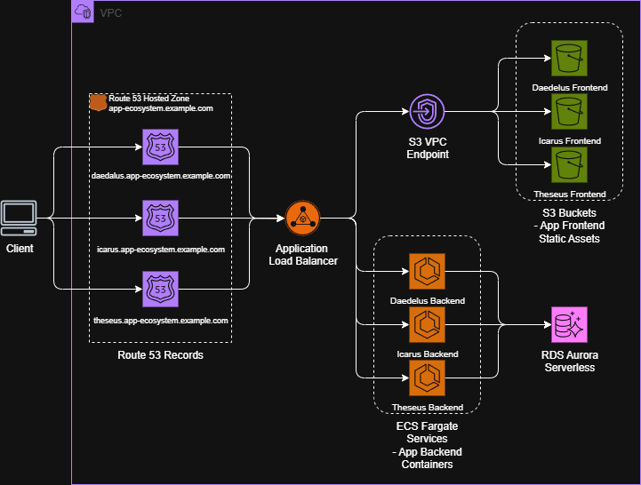
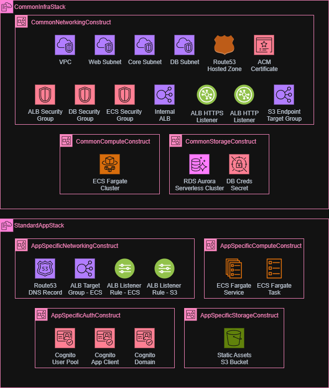
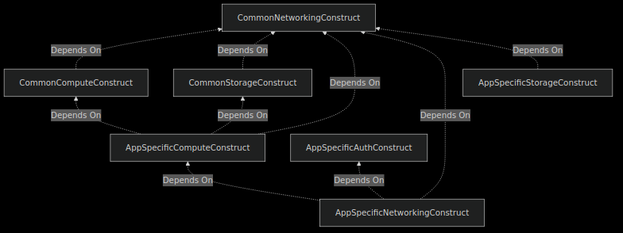

# CDK Tech Test

This is a toy example AWS CDK (for Python) codebase designed for the purposes of testing proficiency with AWS CDK, Python and AWS cloud infrastructure in general.

The initial exercise is to get all dependencies installed and setup/initialise this repo. 

The subsequent exercises for the tech test are detailed in the [TECH_TEST_INSTRUCTIONS.md](TECH_TEST_INSTRUCTIONS.md) file.

### Disclaimer
The CDK codebase in this repo is **NOT** intended to be a fully functional, deployable and standalone AWS cloud solution. It is purely for the purposes of testing AWS CDK proficiency, with the 'solution' to each exercise merely requiring that the `cdk synth` command succeeds, not that any actual cloud resources are deployed.

## Requirements/Dependencies
You must already have the following installed and available:
- Python
- [uv](https://docs.astral.sh/uv/) (Python package manager)
- NodeJS (required to use the CDK CLI) - using [nvm](https://github.com/nvm-sh/nvm?tab=readme-ov-file#installing-and-updating) to install NodeJS is recommend 
- [npm](https://docs.npmjs.com/downloading-and-installing-node-js-and-npm) (required to install CDK CLI) 
- [AWS CDK (Cloud Development Kit) CLI](https://docs.aws.amazon.com/cdk/v2/guide/cli.html)

## Repo Setup - Initial Exercise
The first exercise is to install all the abovementioned dependencies, initialise the repo (use `uv` to create a Python virtual environment that is synced with the required Python packages), and get the `cdk synth` command successfully emitting synthesised CloudFormation templates to the `cdk.out` directory.

### Relevant Docs
- [uv Project Management](https://docs.astral.sh/uv/concepts/projects/sync/)
- [AWS CDK CLI reference](https://docs.aws.amazon.com/cdk/v2/guide/cli.html)
- [AWS CDK CLI commands reference](https://docs.aws.amazon.com/cdk/v2/guide/ref-cli-cmd.html)
- [AWS CDK Library/API reference](https://docs.aws.amazon.com/cdk/api/v2/docs/aws-construct-library.html)

## Repo Walkthrough

### Solution Overview
This toy example CDK codebase encapsulates the AWS cloud infrastructure for a hypothetical 'ecosystem' of private web apps deployed for internal use at a given organisation.

The ecosystem currently contains three (dummy) apps - Daedalus, Icarus and Theseus.

These apps are intended to follow the same architecture pattern:
- Private/internal network connectivity - all inbound traffic routed via a shared private ALB that only accepts traffic from a given private org VPN CIDR range
- Frontend assets served from S3, backend applications dockerised and hosted in ECS
- Serverless first - leveraging AWS services like S3, ECS Fargate and RDS Aurora serverless, to simplify the management & scaling of the application infrastructure
- Common infrastructure components - such as a shared ALB and shared RDS cluster, to reduce overall AWS resource costs

The cloud infrastructure for this entire platform/ecosystem is centralised in this one CDK codebase - the frontends and backends of these applications are expected to be developed and managed in separate repositories:
- Frontend assets are expected to be built and pushed directly to each app's respective static assets S3 bucket
- Backend application Docker images are expected to be built and pushed to a container registry from which ECS will pull them at deployment time

### Cloud Architecture Diagram

### CDK Codebase Structure
#### Stacks
The codebase defines two [CDK 'stack' classes](https://docs.aws.amazon.com/cdk/v2/guide/stacks.html) - one for common infrastructure shared by all apps, and one 'standard app' stack that includes app-specific resources.

A single instance of the common infra stack will be instantiated, and each app will instantiate its own instance of the standard app stack.

#### App Definitions
For each app, an 'app config' is defined within the [app_ecosystem/config/apps.json](app_ecosystem/config/apps.json) file. This config specifies the app's name, a reference to the Docker image URI for the app's backend (dummy values in this case), a priority band to distinguish this app's listener rules in the shared ALB, and CPU/memory values to configure for the app's backend ECS task.

[app.py](app.py) loops through these app configs and instantiates a `StandardAppStack` for each one, passing the respective app config to configure the stack for each particular app.

#### Constructs
Within each of the abovementioned stacks, the underlying AWS resources are grouped into logical components [known in CDK as 'constructs'](https://docs.aws.amazon.com/cdk/v2/guide/constructs.html). The constructs are structured firstly by whether they are for common or app-specific infra, and then roughly according to the 'role' they fulfil in the architecture: auth, compute, storage and networking.

A breakdown of how the underlying AWS resources compose into the constructs (and stacks) is visualised below:

The dependencies between these constructs can be visulised as follows:
